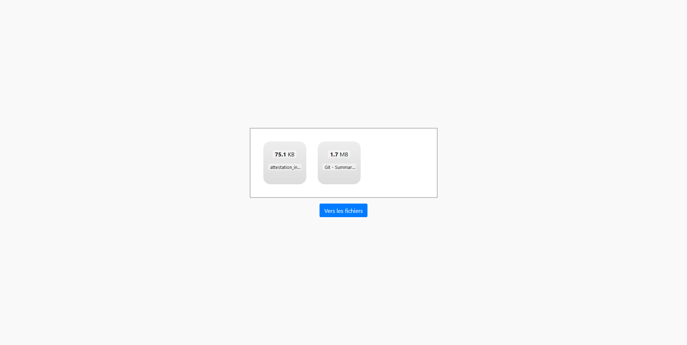
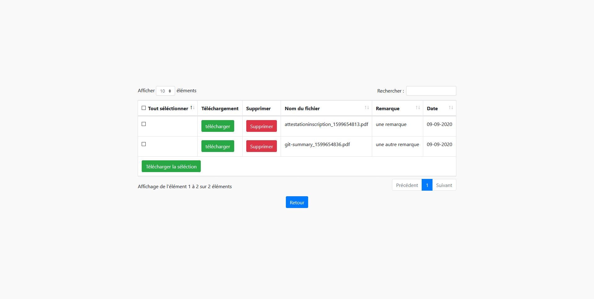

# Gestionnaire d'upload PHP 

Upload de fichiers ainsi que téléchargement du fichier ou des fichiers qui ont été upload.

Techno : 

* bootstrap 
* datatable (librairie javascript)
* dropzonejs (librairie javascript)
* PHP

Simple zone de drag and drop pour upload des fichiers, ainsi qu'une page permettant de télécharger les fichiers qui ont été upload. 
Téléchargement fichier par ficher ou par téléchargement multipe avec un fichier ZIP. 
Possibilité de rajouter une remarque après l'upload en cliquant sur la miniature du fichier à l'intérieur de la zone de drag and drop.

### zone d'upload : 

### modal remarque : 

### page de download : 

